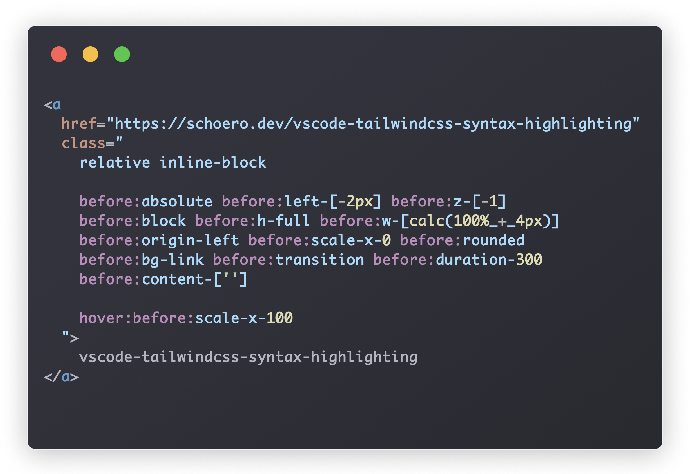

<div align="center">
  <picture>
    <source srcset="./assets/logo.svg">
    
  </picture>
</div>

<h1 align="center">vscode-tailwindcss-syntax-highlighting</h1>

<br/>
<br/>

<div align="center">

  [](https://github.com/schoero/vscode-tailwindcss-syntax-highlighting/blob/main/LICENSE)
  [](https://marketplace.visualstudio.com/items?itemName=schoero.vscode-tailwindcss-syntax-highlighting)
  [](https://github.com/schoero/vscode-tailwindcss-syntax-highlighting/issues)
  [](https://marketplace.visualstudio.com/items?itemName=schoero.vscode-tailwindcss-syntax-highlighting)
  [](https://github.com/schoero/vscode-tailwindcss-syntax-highlighting/stargazers)
  [](https://github.com/schoero/vscode-tailwindcss-syntax-highlighting/actions?query=workflow%3ACI)

</div>

<br/>
<br/>

<div align="center">
VSCode extension that adds syntax highlighting for tailwindcss classes in JavaScript, TypeScript, JSX files.
</div>

<br/>
<br/>

<div align="center">
  
</div>

<br/>
<br/>

<div align="center">
  <a href="https://github.com/sponsors/schoero">
    <picture>
      <source srcset="./assets/sponsor-dark.svg">
      
    </picture>
  </a>
</div>

<div align="center">
  This project is financed by the community.  
  If you or your company benefit from this project, please consider becoming a sponsor or making a one-time donation.  
  Your contribution will help me to maintain and develop the project.
</div>

<br/>
<br/>

### Customization

You can customize the colors of the syntax highlighting in your settings.json file.

```jsonc
{
  "editor.tokenColorCustomizations": {
    "textMateRules": [
      {
        // tailwind variant modifier eg. hover: or before:
        "scope": "variant.tailwindcss",
        "settings": {
          "foreground": "#B583D3"
        }
      },
      {
        // tailwind classes eg. flex or rounded
        "scope": "class.tailwindcss",
        "settings": {
          "foreground": "#CA7979"
        }
      },
      {
        // the property name of a custom property eg. [top:_10px]
        "scope": "property-name.tailwindcss",
        "settings": {
          "foreground": "#CA7979"
        }
      },
      {
        // the value of a custom property eg. [top:_10px]
        "scope": "property-value.tailwindcss",
        "settings": {
          "foreground": "#BABABA"
        }
      }
    ]
  }
}
```

<br/>
<br/>

### Want to further improve the readability of your tailwindcss classes?

Check out [eslint-plugin-readable-tailwind](https://github.com/schoero/eslint-plugin-readable-tailwind) to automatically break up long tailwind class strings into multiple lines based on a specified print width or class count.
